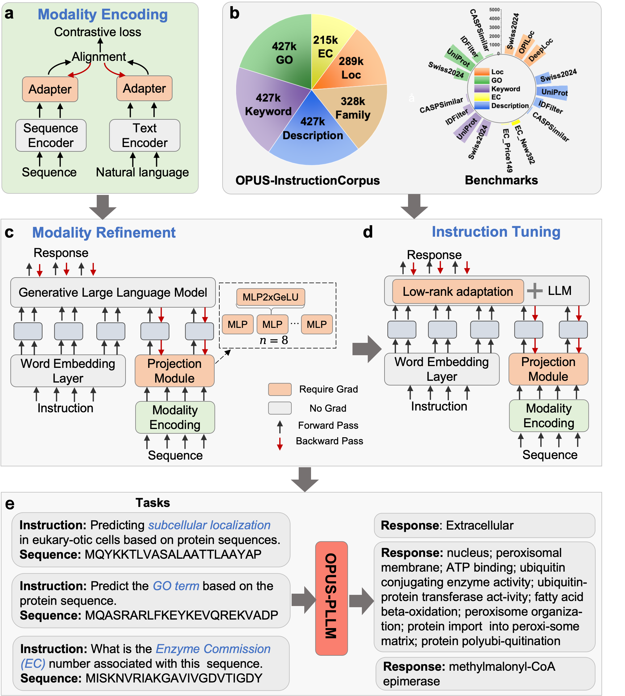

# OPUS-PLLM: Advancing Generative Large Language Models Toward Discriminative Performance in Protein Function Prediction

Here is the official codebase for OPUS-PLLM: Advancing Generative Large Language Models Toward Discriminative Performance in Protein Function Prediction.


## 🧩 Dependencies

1. First, Create a new virtual python3.10 enviroment and activate it. We recommend you to deploy this project in cuda11.8.

```shell
conda create -n OpusPLLM python=3.10
conda activate OpusPLLM
```

2. Install **PyTorch with cuda-11.8** using pip following the instructions in [link](https://pytorch.org/get-started/locally/). In this project, we employ **torch==2.4.0** and its corresponding dependencies so you can download it with command:

```shell
pip install torch==2.4.0 torchvision==0.19.0 torchaudio==2.4.0 --index-url https://download.pytorch.org/whl/cu118
```
  And download xformers:

```shell
pip install xformers==0.0.27.post2 --index-url https://download.pytorch.org/whl/cu118
```

3. Install most packages required through requirements.txt.

```shell
pip install -r requirements.txt
```

4. Detect whether your conda support CXXABI1.3.9 using command 

```shell
strings $CONDA_PREFIX/lib/libstdc++.so.6 | grep CXXABI
```

  If CXXABI_1.3.9 is not returned, using command following to download libstdcxx-ng to support  **bitsandbytes**

```shell
conda install -c conda-forge libstdcxx-ng
```

5. Finally, setup the project using:

```shell
export PYTHONPATH=/path/to/OPUS_PLLM/
```

## 📦 Datasets and Benchmarks

As mentioned in the article, we have two versions of the dataset for training:  OPUS-InstructionCorpus and OPUS-InstructionCorpus-Evol.

Upon acceptance of the paper, both training datasets will be released via our Huggingface dataset repos [OPUS-InstructionCorpus](https://huggingface.co/datasets/YifanXu24/OPUS-InstructionCorpus) 👈🤗 and [OPUS-InstructionCorpus-Evol](https://huggingface.co/datasets/YifanXu24/OPUS-InstructionCorpus-Evol) 👈🤗.  

Also, 17 test datasets of our benchmark are all open-sourced [here](https://huggingface.co/YifanXu24/OPUS-InstructionCorpus-Benchmark) 👈.  We gratefully acknowledge the teams that contributed some parts of the original test sets(OPI-team, Clean-team, Deeploc-team).

## 🔋 Model Weights and Structure



To evaluate or use OPUS-PLLM, download the following components:

 1. **Base Model Weights:** Corresponding to the generative language model used in stages (c) and (d) of the framework. This component remains frozen throughout all training stages and is responsible for text generation and comprehension.
 
 2. **Modality Encoding Adapter Weights:** Corresponding to stage (a), where protein sequences and textual descriptions are aligned through a dedicated adapter to establish a shared representation space.(modality encoder)
 
 3. **Modality Refinement Projection Weights:** Corresponding to the projection module in stage (c), which converts protein representations into token embeddings compatible with the language model.(modality refinement projector)
 
 4. **LoRA Fine-Tuning Weights:** Corresponding to stage (d), where low-rank adaptation (LoRA) is used to efficiently fine-tune selected layers of the language model, while jointly optimizing the projection module to improve task-specific instruction following.(lora adapter)
 
Except for the base model, the remaining three types of weights can be downloaded from our opud-pllm-weights [Model Zoo](#model-zoo%EF%B8%8F) 👈.

## 🚀 Inference and Evaluation

At first, please ensure you have prepared all the prerequisite environments as specified in the **[Dependencies](#dependencies)** section. If not, please follow the instructions step by step in the **Dependencies** section.

Download the corresponding test sets from our 🤗  [Hugging Face Repo](https://huggingface.co/YifanXu24/OPUS-InstructionCorpus-Benchmark)  and maintain their original name. The evaluation metrics are automatically selected based on specific keywords in the test dataset names. Specifically, test sets containing **"GO"** in their names will be processed through a dedicated pipeline that calculates **precision**, **recall**, and **F1 score** between the generated text and ground truth. The same applies to the others.

### 🔄 OPUS-PLLM-Llama3-8B

If you use OPUS-PLLM-Llama3-8B, the base model (Llama3-8B) can be downloaded [here](https://huggingface.co/meta-llama/Meta-Llama-3-8B) 👈, while the corresponding opus-pllm-weights (modality encoding adapter weights, projection weights, and LoRA weights) can be found in our [Model Zoo](#model-zoo%EF%B8%8F) 👈.

Once all model weights have been prepared, navigate to the evaluation directory: OPUS-PLLM/multi_modality_model/multi_modality_v1/eval/ and execute the provided scripts 

#### For Batch Annotation:

```shell
accelerate launch run_opus_ddp.py  \
--model-base-path /path/Llama3-8B/ \
--opus-pllm-weights-path /path/opus-pllm-weights/ \
--input_path /path/to/file \
--save_path /path/to/save \
```

**model-base-path** specifies the path to the base model directory (e.g., Llama3-8B). **opus-pllm-weights-path** refers to the directory containing the OPUS-PLLM weights, including the modality encoding adapter weights, modality refinement projection weights, and LoRA fine-tuning weights. **input_path** indicates the path to the input test dataset in JSON format. **save_path** defines the output directory where the inference results will be saved.

#### For Online Inference:

```shell
python run_opus_online.py \
--model-base-path /path/Llama3-8B/ \
--opus-pllm-weights-path /path/opus-pllm-weights/ \
```

You can run **OPUS-PLLM-Llama3-8B** in an interactive, single-turn mode directly in the terminal.

The terminal will prompt:

- **Enter your instruction:**  
  e.g., *"Given a protein sequence, predict the corresponding Gene Ontology term that describes its molecular function, biological process, and cellular component."*

- **Enter the protein sequence (or leave empty to skip):**  
  e.g.,  
  `MPYFAQRLYNTCKASFSSDGPITEDALEKVRNVLEKIKPSDVGIEQDAQLARSRSGPLNERNGSNQSPPAIKYLHLHECDSFSIGIFCMPPSSMIPLHNHPGMTVLSKLVYGSMHVKSYDWLEPQLTEPEDPSQARPAKLVKDTEMTAQSPVTTLYPKSGGNIHCFKAITHCAILDILAPPYSSEHDRHCTYFRKSRREDLPGELEVDGEVVTDVTWLEEFQPPDDFVIRRIPYRGPVIRT`

The model will return output like:  
**`cytosol; nucleus; cysteine dioxygenase activity; iron ion binding; cellular response to hypoxia; detection of hypoxia; response to hypoxia`**

### 🔄 OPUS-PLLM-Llama3-8B-Evol

If you want to experience the **OPUS-PLLM-Llama3-8B-Evol's** ability to solve protein-sequence-centered interactive capabilities in conversational mode, or verify its performance on our provided MCQ benchmark, the base model (Llama3-8B-Instruct) can be downloaded [here](https://huggingface.co/meta-llama/Meta-Llama-3-8B-Instruct) 👈, while the corresponding opus-pllm-weights (modality encoding adapter weights, projection weights, and LoRA weights) can be found in our [Model Zoo](#model-zoo%EF%B8%8F) 👈.

#### For Batch MCQ Inference:
```shell
accelerate launch  eval_run_multichoice.py  \
--model-base-path /path/Llama3-8B-Instruct/ \
--opus-pllm-weights-path /path/opus-pllm-weights/ \
--input_path /path/to/file \
--save_path /path/to/save \
```
**model-base-path** represents the path to the Llama3-8B-Instruct, **opus-pllm-weights-path** refers to the directory containing the OPUS-PLLM weights, including the modality encoding adapter weights, modality refinement projection weights, and LoRA fine-tuning weights. **input_path** indicates the path to the input test dataset in JSON format. **save_path** defines the output directory where the inference results will be saved.

#### For Online Inference：

```shell
python eval_run_online.py  \
--model-base-path /path/Llama3-8B-Instruct/ \
--opus-pllm-weights-path /path/opus-pllm-weights/ \
```

Similar to Online Inference script for annotation model, you also need to enter any instruction and protein sequence you want in the terminal and the model will response with diverse and professional response for you. 


## Model Zoo🏛️

We provide four models: **OPUS-PLLM-Llama3-8B**, **OPUS-PLLM-Galactica-1.3B**, and **OPUS-PLLM-Galactica-6.7B** are primarily designed for protein function annotation tasks. **OPUS-PLLM-Llama3-8B-Evol** is specifically designed for diverse and complex daily interactions, with enhanced instruction-following capabilities.

|        Model name        | Model_Type |                          Base Model                          |                  OPUS-PLLM-Weights                   |
| :----------------------: | :--------: | :----------------------------------------------------------: | :----------------------------------------------------------: |
| OPUS-PLLM-Llama3-8B |    Base    | [Llama3-8B](https://huggingface.co/meta-llama/Meta-Llama-3-8B)🐪 | [Link🤗](https://huggingface.co/YifanXu24/OPUS-PLLM-Llama3-8B-Base) |
| OPUS-PLLM-Galactica-1.3B |    Base    | [Galactica-1.3B](https://huggingface.co/facebook/galactica-1.3b)🌌 | [Link🤗](https://huggingface.co/YifanXu24/OPUS-PLLM-Galactica-1.3B-Base) |
| OPUS-PLLM-Galactica-6.7B |    Base    | [Galactica-6.7B](https://huggingface.co/facebook/galactica-6.7b)🌌 | [Link🤗](https://huggingface.co/YifanXu24/OPUS-PLLM-Galactica-6.7B-Base) |
| OPUS-PLLM-Llama3-8B-Evol |    Evol    | [Llama3-8B-Instruct](https://huggingface.co/meta-llama/Meta-Llama-3-8B-Instruct)🐪 | [Link🤗](https://huggingface.co/YifanXu24/OPUS-PLLM-Llama3-8B-Evol) |


##Note on Inference Variability

Our model is an autoregressive language model, in which each token is generated by sampling from the probability distribution over the vocabulary predicted at each step. As a result, even with identical input, the inherent non-determinism introduced by token sampling—combined with variations in hardware resource scheduling (e.g., GPU memory usage)—may lead to slightly different outputs across multiple inference runs. Therefore, the results you obtain may not exactly match the numbers reported in the paper, but they should generally fall within a comparable and stable range.

## Acknowledgements


# Citing OPUS-PLLM

If you find this project helpful, please cite our paper:

@article{opuspllm2025,
  title={OPUS-PLLM: Advancing Generative Large Language Models Toward Discriminative Performance in Protein Function Prediction},
  author={Ying Lv1†, Yifan Xu2†, Gang Xu, and Jianpeng Ma},
  journal={},
  year={2025}
}
# Contact

For any questions or issues, open an issue or contact Ying Lv (lvying@pjlab.org.cn) and Yifan Xu (yfxu24@m.fudan.edu.cn)
